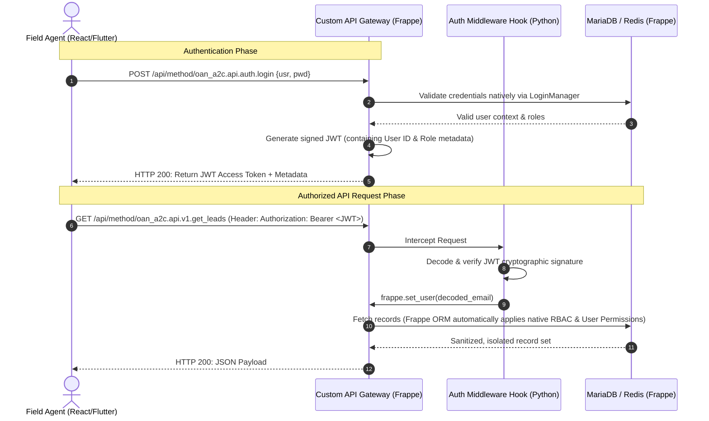

# Architectural Specification & API Contract
## **Access to Credit (A2C) Identity & Access Management (IAM)**

| Document ID | OAN-ADR-001 |
|---|---|
| **System** | OpenAgriNet Access to Credit (oan_a2c) |
| **Component** | Identity and Access Management (IAM) |
| **Status** | Approved for Implementation |
| **Author** | Chief Architect, Sovereign Systems & DPI |

---

## **1. Executive Summary**
This document establishes the architecture and API contract for the Identity and Access Management (IAM) module of the **Access to Credit (A2C)** service component. In alignment with our Digital Public Infrastructure (DPI) security mandates, the platform operates a **purely decoupled, API-first (headless)** architecture. 

It provides secure, stateless **JWT-based authentication** for ReactJS and Flutter frontends, while fully reusing **Frappe's native database layer, Role-Based Access Control (RBAC), and transactional password reset protocols**. This approach maximizes security, future-proofs the system for enterprise Single Sign-On (SSO), and completely avoids reinventing native framework security wheels.

---

## **2. System Architecture & Topology**

The Access to Credit platform operates a stateless security layer. The external ReactJS and Flutter applications never hold permanent session state. Instead, they authenticate to receive a short-lived cryptographically signed token (JWT) which they pass on all subsequent API requests.



---

## **3. Roles & RBAC (Role-Based Access Control)**

We explicitly avoid custom role management. We map incoming JWT sessions to Frappe's native `Has Role` schema.

### **3.1 Custom Roles Defined**
We will configure two new primary roles in the system using standard Frappe permissions:

1.  **`Bank Agent`**:
    *   **Scope:** Employee of a participating commercial bank (e.g., Coop Bank).
    *   **Desk Access:** Disabled (`desk_access = 0`). Only allowed to interact with the system via standard external API contracts.
    *   **Permissions:** Can `Read` leads assigned to their bank; can `Create`, `Read`, and `Submit` `A2C Loan Application` records.
2.  **`Development Agent` (DA)**:
    *   **Scope:** Field officers under the Ministry of Agriculture/ATI assisting rural farmers.
    *   **Desk Access:** Disabled (`desk_access = 0`).
    *   **Permissions:** Can `Create` and `Read` `A2C Lead` entries; can view status of applications they initiated, but cannot edit or view bank-specific risk parameters.

### **3.2 Multi-Tenant Data Isolation (User Permissions)**
To prevent horizontal privilege escalation (e.g., Bank Agent A seeing Bank Agent B's applications):
*   We use Frappe's native **User Permissions**.
*   Users with the `Bank Agent` role are linked to a specific `Participating Bank` document.
*   The Frappe ORM automatically injects database filters during queries so that endpoints like `get_leads` only return records matched to their linked bank.

---

## **4. Core API Specifications**

All endpoints are built using `@frappe.whitelist()` and are versioned under the `oan_a2c.api.auth` namespace.

### **4.1 User Login (JWT Generation)**
Authenticates email and password, returning a stateless JWT and user profile metadata.

*   **Endpoint:** `POST /api/method/oan_a2c.api.auth.login`
*   **Authentication Required:** No (Guest Access Allowed)
*   **Request Headers:**
    *   `Content-Type: application/json`
*   **Request Payload:**
    ```json
    {
      "usr": "agent.ethiopia@coopbank.com",
      "pwd": "SuperSecurePassword123!"
    }
    ```
*   **Success Response (HTTP 200):**
    ```json
    {
      "message": {
        "status": "success",
        "token": "eyJhbGciOiJIUzI1NiIsInR5cCI6IkpXVCJ9.eyJ1c2VyIjoiYWdlbnQuZXRoaW9waWFAY29vcGJhbmsuY29tIiwicm9sZXMiOlsiQmFuayBBZ2VudCJdLCJleHAiOjE3Nzk4NjU2MDB9...",
        "user": {
          "email": "agent.ethiopia@coopbank.com",
          "full_name": "Abebe Bikila",
          "roles": ["Bank Agent"],
          "bank": "Cooperative Bank of Oromia"
        }
      }
    }
    ```
*   **Error Response (HTTP 401 Unauthorized):**
    ```json
    {
      "exception": "frappe.exceptions.AuthenticationError",
      "message": "Incorrect email or password."
    }
    ```

---

### **4.2 Forgot Password Request**
Triggers Frappe's native secure password recovery flow. The backend generates a temporary cryptographically secure token, writes it to the database, and sends an automated reset email containing a link to the user.

*   **Endpoint:** `POST /api/method/oan_a2c.api.auth.forgot_password`
*   **Authentication Required:** No
*   **Request Payload:**
    ```json
    {
      "email": "agent.ethiopia@coopbank.com"
    }
    ```
*   **Success Response (HTTP 200):**
    ```json
    {
      "message": {
        "status": "success",
        "message": "Password reset instructions have been sent to your registered email."
      }
    }
    ```
*   **Architectural Rationale:** We use Frappe's native `frappe.core.doctype.user.user.reset_password(email)` internally. This ensures we inherit all of Frappe's default system protections:
    1.  Validating if the user account is active and not locked.
    2.  Automatic email formatting using the site's standardized system notification templates.
    3.  Enforcing temporary link expiry (standard link lifespan is 24 hours).
    4.  Avoiding storing password reset tokens in plain text in transit.

---

### **4.3 Password Reset Link Handling (Decoupled Bridge)**
When the agent clicks the link in their email:
1.  They are directed to a clean frontend landing page (ReactJS/Flutter).
2.  The URL contains parameters: `?key=<secure_key>&email=<email>`.
3.  The frontend displays a "New Password" form, capturing the input and posting it back to the backend.

*   **Endpoint:** `POST /api/method/oan_a2c.api.auth.reset_password`
*   **Authentication Required:** No (Key-authenticated)
*   **Request Payload:**
    ```json
    {
      "email": "agent.ethiopia@coopbank.com",
      "key": "a8f3b23c91e1d0f8...",
      "new_password": "NewSuperSecurePassword987!"
    }
    ```
*   **Success Response (HTTP 200):**
    ```json
    {
      "message": {
        "status": "success",
        "message": "Your password has been successfully updated. You may now login."
      }
    }
    ```

---

## **5. Security, Cryptography, & Middleware**

To protect sensitive agricultural and credit data under Ethiopia’s regional data protection frameworks:

### **5.1 JWT Design Specs**
*   **Signing Algorithm:** HMAC SHA-256 (`HS256`).
*   **Signature Key:** Derived directly from the local site's private salt (`encryption_key` inside `site_config.json`). This ensures that even if the source code is compromised, tokens cannot be forged without access to the host's runtime environment.
*   **Token Expiration:** Short-lived access tokens (standard expiry is 1 hour).
*   **Token Payload:**
    ```json
    {
      "sub": "agent.ethiopia@coopbank.com",
      "iss": "oan_a2c_identity_gateway",
      "iat": 1779862000,
      "exp": 1779865600,
      "roles": ["Bank Agent"]
    }
    ```

### **5.2 Authentication Middleware Hook**
We implement our JWT validation at the entry boundary. In `hooks.py`, we bind a function to the standard Rest API entry points:

```python
# Pseudo-implementation within oan_a2c/hooks.py
auth_hooks = [
    "oan_a2c.api.auth.middleware.validate_jwt_request"
]
```

#### **How the `validate_jwt_request` hook executes:**
1.  Intercepts all requests under `/api/method/oan_a2c.*`.
2.  Looks for the `Authorization: Bearer <JWT>` header.
3.  Decodes the JWT using the private site key.
4.  If the signature is intact and the timestamp `exp` is in the future:
    *   Calls `frappe.set_user(jwt_payload['sub'])` to securely log the user context into the Python thread memory.
5.  If validation fails (expired or tampered signature), returns an HTTP 401 response and blocks execution before any business controllers are hit.

---

> *"Security at population scale is not about building complex custom cryptosystems; it is about establishing robust boundaries and delegating authentication state reliably. We leverage Frappe's proven core while exposing it through stateless, standard API contracts."*
