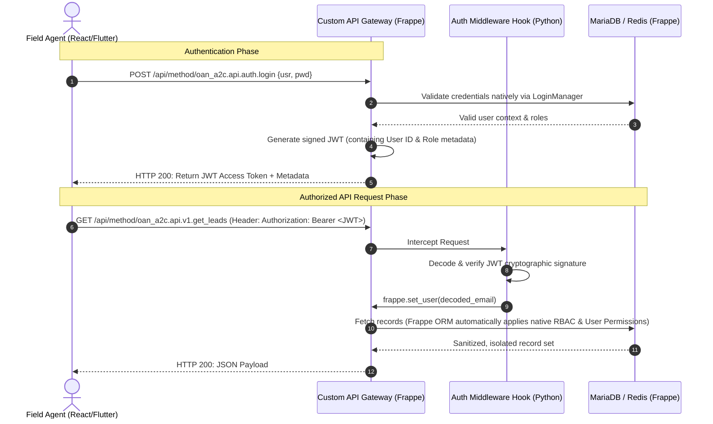

# Architectural Specification & API Contract
## **Access to Credit (A2C) Identity & Access Management (IAM)**

| Document ID | OAN-ADR-001 |
|---|---|
| **System** | OpenAgriNet Access to Credit (oan_a2c) |
| **Component** | Identity and Access Management (IAM) |
| **Status** | Approved for Implementation |
| **Author** | Chief Architect, Sovereign Systems & DPI |

---

## **1. Executive Summary**
This document establishes the architecture and API contract for the Identity and Access Management (IAM) module of the **Access to Credit (A2C)** service component. In alignment with our Digital Public Infrastructure (DPI) security mandates, the platform operates a **purely decoupled, API-first (headless)** architecture. 

It provides secure, stateless **JWT-based authentication** for ReactJS and Flutter frontends, while fully reusing **Frappe's native database layer, Role-Based Access Control (RBAC), and transactional password reset protocols**. This approach maximizes security, future-proofs the system for enterprise Single Sign-On (SSO), and completely avoids reinventing native framework security wheels.

---

## **2. System Architecture & Topology**

The Access to Credit platform operates a stateless security layer. The external ReactJS and Flutter applications never hold permanent session state. Instead, they authenticate to receive a short-lived cryptographically signed token (JWT) which they pass on all subsequent API requests.



---

## **3. Roles & RBAC (Role-Based Access Control)**

We explicitly avoid custom role management. We map incoming JWT sessions to Frappe's native `Has Role` schema.

### **3.1 Custom Roles Defined**
We will configure two new primary roles in the system using standard Frappe permissions:

1.  **`Bank Agent`**:
    *   **Scope:** Employee of a participating commercial bank (e.g., Coop Bank).
    *   **Desk Access:** Disabled (`desk_access = 0`). Only allowed to interact with the system via standard external API contracts.
    *   **Permissions:** Can `Read` leads assigned to their bank; can `Create`, `Read`, and `Submit` `A2C Loan Application` records.
2.  **`Development Agent` (DA)**:
    *   **Scope:** Field officers under the Ministry of Agriculture/ATI assisting rural farmers.
    *   **Desk Access:** Disabled (`desk_access = 0`).
    *   **Permissions:** Can `Create` and `Read` `A2C Lead` entries; can view status of applications they initiated, but cannot edit or view bank-specific risk parameters.

### **3.2 Multi-Tenant Data Isolation (User Permissions)**
To prevent horizontal privilege escalation (e.g., Bank Agent A seeing Bank Agent B's applications):
*   We use Frappe's native **User Permissions**.
*   Users with the `Bank Agent` role are linked to a specific `Participating Bank` document.
*   The Frappe ORM automatically injects database filters during queries so that endpoints like `get_leads` only return records matched to their linked bank.

---

### **3.3 Lead Management Database Schema (A2C Lead)**
The `A2C Lead` DocType acts as the absolute top of the funnel. It is designed to be extremely lightweight, capturing the initial point of contact (usually an automated missed call log) before any heavy agricultural or identity profiling begins.

#### **Lead Metadata**
| Field ID | Label | Field Type | Parameters / Options | Description |
| :--- | :--- | :--- | :--- | :--- |
| `phone_number` | Phone Number | Data (Phone) | Mandatory, Unique (active leads) | The primary identifier captured from the missed call or IVR system. |
| `external_id` | External Reference ID | Data | Optional, Indexed, Programmatically Unique | The correlation ID supplied by the external telco/IVR system. Used for O(1) deduplication. |
| `first_name` | First Name | Data | Optional | The farmer's first name. |
| `last_name` | Last Name | Data | Optional | The farmer's last name. |
| `email` | Email | Data | Optional, Email format | The farmer's email address. |
| `lead_source` | Source | Select | `Missed Call`, `IVR`, `SMS`, `Agent Entry` | Origin of the lead (defaults to Missed Call). |
| `status` | Lead Status | Select | `Active`, `Verified`, `Processed`, `Granted`, `Rejected`, `Dormant` | Workflow state of the initial discovery call. |
| `assigned_to` | Assigned Agent | Link | `User` (DocType) | The call center agent or DA tasked with calling the farmer back. |
| `call_notes` | Initial Call Notes | Text | Multiline | Brief summary of the initial discovery call. |
| `linked_credit_case`| Converted Credit Case | Link | `A2C Credit Case` (DocType) | Read-only reference populated automatically when the lead expresses interest. |

**Lead Lifecycle Constraint:** Once the `status` reaches **`Processed`** and the `A2C Credit Case` is initialized, this Lead document becomes immutable (locked). All subsequent heavy data gathering (names, addresses, farm details) happens entirely inside the `A2C Credit Case`.

**Conditional Uniqueness Policy:** Internal agents can create manual leads directly via the Desk without an `external_id`. To allow this while preventing duplicate external ingestions, the system enforces database-level indexing for $O(1)$ lookup speeds but handles the unique constraint programmatically in the controller (`before_save`).

---

### **3.4 Credit Information Schema (A2C Credit Information)**
This schema captures requested loan profiles associated with a discovery lead before initiating a formal underwriting case.

| Field ID | Label | Field Type | Parameters / Options | Description |
| :--- | :--- | :--- | :--- | :--- |
| `lead` | Lead | Link | Options: `A2C Lead` (Mandatory) | The associated lead. |
| `loan_type` | Loan Type | Select | Lookup options (Mandatory) | The category of credit requested by the lead. |
| `loan_amount` | Loan Amount | Currency | Numeric (Mandatory) | The amount requested in ETB. |
| `purpose_message` | Purpose Message | Small Text | Mandatory | Detailed text/notes explaining the requirement. |
| `created_by` | Created By | Link | Options: `User` (Read Only) | The agent who recorded the request. |

**Permissions Policy:**
*   **`Development Agent` (DA):** Can Create and Read records.
*   **`Bank Agent`:** Read-only access.
*   **`System Manager`:** Full permissions.

---

### **3.5 Credit Case Database Schema (Input Fields)**
To satisfy the pre-qualification and data gathering phase, the `A2C Credit Case` DocType will be built using the following structural data fields, grouped into distinct sections:

#### **Section A: Loan Requirements**
| Field ID | Label | Field Type | Parameters / Options | Description |
| :--- | :--- | :--- | :--- | :--- |
| `loan_type` | Loan Type | Select | `Input Financing`, `Machinery/Equipment`, `Conventional`, `Murabaha (Islamic Financing)` | Mandatory field for the category of credit requested. |
| `loan_purpose` | Purpose of loan | Data | e.g. "Agro-processing" | Specific agricultural application. |
| `requested_amount` | Requested Loan Amount (ETB) | Currency | Numeric | Minimum amount requested for underwriting. |
| `loan_duration` | Loan Duration (Months) | Select | `12 Months (1 Year)`, `24 Months (2 Years)`, `36 Months (3 Years)` | Period of recovery. |
| `nearest_branch` | Nearest Branch Responsible for Loan Administration | Link | `Branch` (DocType link) | Geographical servicing branch. |

#### **Section B: Crop & Land Information**
| Field ID | Label | Field Type | Parameters / Options | Description |
| :--- | :--- | :--- | :--- | :--- |
| `primary_crop` | Primary Crop/Seed Variety | Select | `Barley`, `Wheat`, `Soybeans`, `Maize`, `Other Variety` | Primary crop classification. |
| `crop_variety` | Crop Variety | Select | Dropdown dependent on `primary_crop` | Specific seed strain variation. |
| `address` | Address | Data | String | General farmer location. |
| `seed_qty_requested` | Quantity Requested (Kg) | Float | Numeric | Mass of seeds required. |
| `seed_unit_price` | Unit Price | Currency | Numeric | Cost per Kg. |
| `total_seed_cost` | Total Seed Cost | Currency | Formula: `seed_qty_requested` * `seed_unit_price` | Autocalculated or entered cost. |
| `land_size` | Land Size (Hectares) | Float | Numeric | Farm land area in hectares. |
| `expected_yield` | Expected Yield (Quintals/Hectare) | Float | Numeric | Expected productivity metrics. |
| `expected_harvest_date` | Expected Harvest Date | Date | Calendar Selection | Expected harvest period for crop security. |
| `fertilizer_used` | Fertilizer Used | Data | String | Type of soil enhancement deployed. |
| `other_farming_activities` | Other Farming Activities | Select | `Cattle`, `Poultry`, `Sheep&Goats`, `Other income sources` | Diversified agricultural streams. |
| `farmer_group` | Farmer Group | Data | String | Cooperative or community aggregation group. |
| `animal_housed` | Animal Housed (Heads) | Int | Numeric | Livestock count. |
| `farm_equipped` | Farm Equipped (Units) | Int | Numeric | Machinery equipment units available. |
| `farm_size_machines` | Farm Size (Hectares) | Float | Numeric | Farm machine size capacity. |
| `region` | Region | Select | Standard Ethiopian Regions (e.g. `Oromia`) | Geographical region layer. |
| `zone` | Zone | Select | Standard Ethiopian Zones (e.g. `East Shewa`) | Geographical zone layer. |
| `woreda` | Woreda / District | Select | Standard Woredas (e.g. `Ada'ama`) | District administrative layer. |
| `kebele` | Kebele | Data | String | Smallest local administrative unit. |
| `aggregation_type` | Harvest Aggregation Type | Select | `Primary Cooperative`, `Nucleus Farmer` | Offtake aggregation classification. |
| `aggregator_name` | Name of Cooperative / Nucleus Farmer | Data | String | Aggregation legal entity name. |

#### **Section C: Fertilizer Requirement**
| Field ID | Label | Field Type | Parameters / Options | Description |
| :--- | :--- | :--- | :--- | :--- |
| `dap_qty_kg` | DAP Quantity (Kg) | Float | Numeric | Mass of Diammonium Phosphate. |
| `urea_qty_kg` | UREA Quantity (Kg) | Float | Numeric | Mass of Urea required. |
| `fertilizer_unit_price` | Unit Price per Fertilizer Type | Select | Float options | Unit rates per chemical type. |
| `total_fertilizer_cost` | Total Fertilizer Cost | Currency | Numeric | Summed cost of required soil enrichers. |

#### **Section D: Crop Protection Requirement**
| Field ID | Label | Field Type | Parameters / Options | Description |
| :--- | :--- | :--- | :--- | :--- |
| `agrochemical_type` | Type of Agrochemical Requested | Select | Agrochemical catalog | Crop protection chemical type. |
| `agrochemical_qty` | Quantity Requested | Float | Numeric | Mass/Volume required. |
| `agrochemical_price` | Unit Price | Currency | Numeric | Rate per unit of chemical. |
| `total_crop_protection_cost` | Total Crop Protection Cost | Currency | Formula: `agrochemical_qty` * `agrochemical_price` | Total cost of pesticides/herbicides. |

#### **Section E: Financing & Pricing Information**
| Field ID | Label | Field Type | Parameters / Options | Description |
| :--- | :--- | :--- | :--- | :--- |
| `selected_supplier` | Selected Input Supplier | Link | `Supplier` (DocType link) | Approved DPG agritech inputs vendor. |
| `upfront_male` | Upfront Contribution (Male Farmers %) | Float | Percentage (0-100) | Cash contribution requirement. |
| `upfront_female` | Upfront Contribution (Female Farmers %) | Float | Percentage (0-100) | Affirmative action pricing percentage. |
| `insurance_premium` | Crop Insurance Premium (%) | Float | Percentage (0-100) | Agricultural yield risk mitigation rate. |

#### **Section F: Banking Information**
| Field ID | Label | Field Type | Parameters / Options | Description |
| :--- | :--- | :--- | :--- | :--- |
| `bank_account_name` | Bank Account Name | Data | String | Legal bank account name (must match Fayda verification). |
| `bank_account_no` | Bank Account Number | Data | String | Standard credit disbursement account. |
| `bank_name` | Bank Name | Link | `Bank` (DocType link) | Underwriting institution. |
| `bank_swift_ifsc` | Bank Swift/IFSC Code | Data | String | Interbank routing metadata. |
| `mobile_account_name` | Mobile Account Name | Data | String | Mobile wallet account owner (M-Pesa/Telebirr). |
| `mobile_payments_no` | Mobile Payments Number | Data | String | Primary mobile wallet disbursement line. |

#### **Section G: Borrowing Amount & Tax ID**
| Field ID | Label | Field Type | Parameters / Options | Description |
| :--- | :--- | :--- | :--- | :--- |
| `total_borrowed_amount` | Total Amount You Are Borrowing | Currency | Formula | Unified loan ledger value. |
| `tax_id` | Tax ID | Data | 9-digit validation mask | Legal tax representation number. |

---

## **4. Core API Specifications**

All endpoints are built using `@frappe.whitelist()` and are versioned under the `oan_a2c.api.auth` namespace.

### **4.1 User Login (JWT Generation)**
Authenticates email and password, returning a stateless JWT and user profile metadata.

*   **Endpoint:** `POST /api/method/oan_a2c.api.auth.login`
*   **Authentication Required:** No (Guest Access Allowed)
*   **Request Headers:**
    *   `Content-Type: application/json`
*   **Request Payload:**
    ```json
    {
      "usr": "agent.ethiopia@coopbank.com",
      "pwd": "SuperSecurePassword123!"
    }
    ```
*   **Success Response (HTTP 200):**
    ```json
    {
      "message": {
        "status": "success",
        "token": "eyJhbGciOiJIUzI1NiIsInR5cCI6IkpXVCJ9.eyJ1c2VyIjoiYWdlbnQuZXRoaW9waWFAY29vcGJhbmsuY29tIiwicm9sZXMiOlsiQmFuayBBZ2VudCJdLCJleHAiOjE3Nzk4NjU2MDB9...",
        "user": {
          "email": "agent.ethiopia@coopbank.com",
          "full_name": "Abebe Bikila",
          "roles": ["Bank Agent"],
          "bank": "Cooperative Bank of Oromia"
        }
      }
    }
    ```
*   **Error Response (HTTP 401 Unauthorized):**
    ```json
    {
      "exception": "frappe.exceptions.AuthenticationError",
      "message": "Incorrect email or password."
    }
    ```

---

### **4.2 Forgot Password Request**
Triggers Frappe's native secure password recovery flow. The backend generates a temporary cryptographically secure token, writes it to the database, and sends an automated reset email containing a link to the user.

*   **Endpoint:** `POST /api/method/oan_a2c.api.auth.forgot_password`
*   **Authentication Required:** No
*   **Request Payload:**
    ```json
    {
      "email": "agent.ethiopia@coopbank.com"
    }
    ```
*   **Success Response (HTTP 200):**
    ```json
    {
      "message": {
        "status": "success",
        "message": "Password reset instructions have been sent to your registered email."
      }
    }
    ```
*   **Architectural Rationale:** We use Frappe's native `frappe.core.doctype.user.user.reset_password(email)` internally. This ensures we inherit all of Frappe's default system protections:
    1.  Validating if the user account is active and not locked.
    2.  Automatic email formatting using the site's standardized system notification templates.
    3.  Enforcing temporary link expiry (standard link lifespan is 24 hours).
    4.  Avoiding storing password reset tokens in plain text in transit.

---

### **4.3 Password Reset Link Handling (Decoupled Bridge)**
When the agent clicks the link in their email:
1.  They are directed to a clean frontend landing page (ReactJS/Flutter).
2.  The URL contains parameters: `?key=<secure_key>&email=<email>`.
3.  The frontend displays a "New Password" form, capturing the input and posting it back to the backend.

*   **Endpoint:** `POST /api/method/oan_a2c.api.auth.reset_password`
*   **Authentication Required:** No (Key-authenticated)
*   **Request Payload:**
    ```json
    {
      "email": "agent.ethiopia@coopbank.com",
      "key": "a8f3b23c91e1d0f8...",
      "new_password": "NewSuperSecurePassword987!"
    }
    ```
*   **Success Response (HTTP 200):**
    ```json
    {
      "message": {
        "status": "success",
        "message": "Your password has been successfully updated. You may now login."
      }
    }
    ```

---

### **4.4 External Lead Ingestion Webhook**
To support automated intake from external telecommunication systems (e.g., IVR or Missed Call gateways), this dedicated webhook acts as the automated funnel entry.

*   **Endpoint:** `POST /api/method/oan_a2c.api.v1.webhooks.lead_inbound`
*   **Authentication Required:** Yes (System API Key & API Secret via standard Frappe `Authorization: token <key>:<secret>` header).
*   **Request Payload:**
    ```json
    {
      "phone_number": "+251911000000",
      "lead_source": "Missed Call",
      "external_ref_id": "TELCO-778899",
      "timestamp": "2026-05-19T10:00:00Z"
    }
    ```
*   **Success Response (HTTP 200):**
    ```json
    {
      "message": {
        "status": "success",
        "lead_id": "LEAD-2026-00001",
        "message": "Lead captured successfully."
      }
    }
    ```
*   **Idempotency & Dual-ID Deduplication Logic:** 
    1. **Primary Check (External Reference):** If `external_ref_id` is supplied, the webhook queries the indexed `external_id` field. If a match is found (even if closed or processed), it is updated idempotently rather than duplicated.
    2. **Secondary Check (Active Funnel):** If no `external_ref_id` matches but an active lead (status `Active` or `Verified`) already exists for the supplied `phone_number`, the system updates the existing lead's `call_notes` with the new event data.
    3. **Ingest & Creation:** If both checks fail, a new `A2C Lead` is created with the `external_id` set to `external_ref_id` to preserve lineage.

---

### **4.5 Paginated Lead Search & Filtering API**
Exposes a secure, JWT-authenticated endpoint to query and retrieve leads with multi-faceted filtering, elastic offset pagination, and bounded limits to prevent memory-exhaustion attacks.

*   **Endpoint:** `GET /api/method/oan_a2c.api.v1.leads.get_leads`
*   **Authentication Required:** Yes (JWT Bearer Token inside standard `Authorization: Bearer <token>` header).
*   **Request Parameters:**
    *   `start` *(Optional Int)*: Offset index to begin slice retrieval (defaults to `0`).
    *   `page_length` *(Optional Int)*: Max slice count to return (defaults to `20`, hard-capped at `100`).
    *   `search_query` *(Optional String)*: Fuzzy match substring querying across `name` (Lead ID), `phone_number`, and `external_id`.
    *   `status` *(Optional String)*: Filter matching strict schema values (`Active`, `Verified`, `Processed`, `Granted`, `Rejected`, `Dormant`).
    *   `lead_source` *(Optional String)*: Filter matching source (`Missed Call`, `IVR`, `SMS`, `Agent Entry`).
    *   `start_date` / `end_date` *(Optional String, YYYY-MM-DD)*: Boundary range matching Lead creation dates.
*   **Success Response (HTTP 200):**
    ```json
    {
      "message": {
        "status": "success",
        "start": 0,
        "page_length": 2,
        "total_count": 142,
        "results": [
          {
            "name": "LEAD-2026-00001",
            "phone_number": "+251911000001",
            "external_id": "TELCO-778899",
            "lead_source": "Missed Call",
            "status": "Verified",
            "assigned_to": "agent.ethiopia@coopbank.com",
            "creation": "2026-05-26 12:00:00"
          },
          {
            "name": "LEAD-2026-00002",
            "phone_number": "+251911000002",
            "external_id": null,
            "lead_source": "Agent Entry",
            "status": "Active",
            "assigned_to": null,
            "creation": "2026-05-26 12:05:00"
          }
        ]
      }
    }
    ```

---

### **4.6 Native Lead Creation API**
Exposes a secure, JWT-authenticated endpoint to create a new `A2C Lead` natively from the A2C field agent interface.

*   **Endpoint:** `POST /api/method/oan_a2c.api.v1.leads.create_lead`
*   **Authentication Required:** Yes (JWT Bearer Token inside standard `Authorization: Bearer <token>` header).
*   **Request Payload:**
    ```json
    {
      "phone_number": "+251911000003",
      "first_name": "Abebe",
      "last_name": "Bikila",
      "email": "abebe.bikila@coopbank.com",
      "lead_source": "Agent Entry",
      "external_id": "PARTNER-990011"
    }
    ```
*   **Success Response (HTTP 200):**
    ```json
    {
      "message": {
        "status": "success",
        "lead_id": "LEAD-2026-00003",
        "message": "Lead created successfully."
      }
    }
    ```
*   **Validation Rules:**
    1. **Role Permissions:** Authenticated user must have create permission on `A2C Lead`.
    2. **Phone & External ID Duplication:** Conditional uniqueness rules on active phone numbers and external IDs are evaluated natively by the controller.
    3. **Email Formatting:** Enforces strict regex validation on the email address.

---

### **4.7 Get Lead Summary (Metrics Dashboard)**
Provides aggregated, cache-aware lead metrics grouped by their workflow states. Excellent for field dashboards and high-level progress tracking.

*   **Endpoint:** `GET /api/method/oan_a2c.api.v1.leads.get_lead_summary`
*   **Authentication Required:** Yes (JWT Bearer Token inside standard `Authorization: Bearer <token>` header).
*   **Request Parameters:** None.
*   **Success Response (HTTP 200):**
    ```json
    {
      "message": {
        "status": "success",
        "total": 5,
        "by_status": {
          "Active": 2,
          "Verified": 1,
          "Processed": 1,
          "Granted": 1,
          "Rejected": 0,
          "Dormant": 0
        }
      }
    }
    ```
*   **Security & Execution Specs:**
    1. **Role Permissions:** Authenticated user must have `read` permissions on the `A2C Lead` DocType.
    2. **Multi-Tenant Isolation:** Relies entirely on `frappe.get_list` to automatically enforce multi-tenant database filtering based on active User Permissions.

---

### **4.8 Get Lead Metadata (Forms Dropdown Options)**
Dynamically loads valid Select options for metadata fields within Lead forms. Avoids hardcoding status or source collections in decoupled frontends.

*   **Endpoint:** `GET /api/method/oan_a2c.api.v1.leads.get_lead_metadata`
*   **Authentication Required:** Yes (JWT Bearer Token inside standard `Authorization: Bearer <token>` header).
*   **Request Parameters:** None.
*   **Success Response (HTTP 200):**
    ```json
    {
      "message": {
        "status": "success",
        "statuses": [
          "Active",
          "Verified",
          "Processed",
          "Granted",
          "Rejected",
          "Dormant"
        ],
        "sources": [
          "Missed Call",
          "IVR",
          "SMS",
          "Agent Entry"
        ],
        "loan_types": [
          "Input loan (seeds, agrochemicals)",
          "Agricultural term loan",
          "Smallholder short-term loan",
          "Land loan",
          "Farm equipment loan",
          "Smallholder farmer direct loan"
        ]
      }
    }
    ```
*   **Security Specs:**
    1. **Role Permissions:** Authenticated user must have `read` permissions on the `A2C Lead` DocType.

---

### **4.9 Add Lead Comment**
Decoupled API bridge to attach user-generated comments or manual timeline notes to a specific lead. Directly hooks into Frappe's native timeline mechanism.

*   **Endpoint:** `POST /api/method/oan_a2c.api.v1.leads.add_lead_comment`
*   **Authentication Required:** Yes (JWT Bearer Token inside standard `Authorization: Bearer <token>` header).
*   **Request Payload:**
    ```json
    {
      "lead_id": "LEAD-2026-00003",
      "content": "Called farmer; requested follow-up next Tuesday."
    }
    ```
*   **Success Response (HTTP 200):**
    ```json
    {
      "message": {
        "status": "success",
        "comment_id": "COM00000001",
        "message": "Comment added successfully."
      }
    }
    ```
*   **Validation & Security Specs:**
    1. **Parameter Enforcement:** Enforces presence of both `lead_id` and `content`, returning standard `400` errors on empty inputs.
    2. **Document-Level Permissions:** Checks explicit user `write` permissions on the specific document instance via `frappe.has_permission(..., doc=lead_id)`.

---

### **4.10 Get Lead Timeline (History Log)**
Retrieves the complete history of comments and automated system activities associated with a specific lead, ordered from newest to oldest.

*   **Endpoint:** `GET /api/method/oan_a2c.api.v1.leads.get_lead_timeline`
*   **Authentication Required:** Yes (JWT Bearer Token inside standard `Authorization: Bearer <token>` header).
*   **Request Parameters:**
    *   `lead_id` *(Required String)*: ID of the targeted lead.
*   **Success Response (HTTP 200):**
    ```json
    {
      "message": {
        "status": "success",
        "lead_id": "LEAD-2026-00003",
        "timeline": [
          {
            "name": "COM00000001",
            "comment_by": "test_agent@coopbank.com",
            "content": "Called farmer; requested follow-up next Tuesday.",
            "creation": "2026-05-27 12:00:00",
            "comment_type": "Comment"
          }
        ]
      }
    }
    ```
*   **Security Specs:**
    1. **Document-Level Permissions:** Checks explicit user `read` permissions on the specific document instance via `frappe.has_permission(..., doc=lead_id)`.

---

### **4.11 Get Lead Call Logs (Call History)**
Parses unstructured raw multiline telco and call agent logs from the lead's notes into a clean, structured JSON collection.

*   **Endpoint:** `GET /api/method/oan_a2c.api.v1.leads.get_lead_call_logs`
*   **Authentication Required:** Yes (JWT Bearer Token inside standard `Authorization: Bearer <token>` header).
*   **Request Parameters:**
    *   `lead_id` *(Required String)*: ID of the targeted lead.
*   **Success Response (HTTP 200):**
    ```json
    {
      "message": {
        "status": "success",
        "lead_id": "LEAD-2026-00003",
        "call_logs": [
          {
            "source": "Missed Call",
            "ref_id": "TELCO-778899",
            "timestamp": "2026-05-27T12:00:00Z"
          }
        ]
      }
    }
    ```
*   **Security & Parser Specs:**
    1. **Document-Level Permissions:** Checks explicit user `read` permissions on the specific document instance via `frappe.has_permission(..., doc=lead_id)`.
    2. **Dynamically Parsed Values:** Converts structured ` | ` separated string segments within the `call_notes` field into low-friction JSON objects.

---

### **4.12 Schedule Visit**
Schedules a physical or field agent visit for a specific lead, updates the lead status, and appends a system notification to the lead's timeline history.

*   **Endpoint:** `POST /api/method/oan_a2c.api.v1.leads.schedule_visit`
*   **Authentication Required:** Yes (JWT Bearer Token inside standard `Authorization: Bearer <token>` header).
*   **Request Payload:**
    ```json
    {
      "lead_id": "LEAD-2026-00003",
      "visit_date": "2026-06-10",
      "visit_time": "14:30:00",
      "region": "Oromia",
      "zone": "East Shewa",
      "woreda": "Ada'ama",
      "kebele": "Kebele 02",
      "meeting_location": "Cooperative Office",
      "notes": "Bring physical copies of farm documents"
    }
    ```
*   **Success Response (HTTP 200):**
    ```json
    {
      "message": {
        "status": "success",
        "schedule_id": "VSCH-2026-00001",
        "message": "Visit scheduled successfully."
      }
    }
    ```
*   **Validation & Side Effects:**
    1. **Role Permissions:** Enforces write permissions on `A2C Lead` and create permissions on `A2C Visit Schedule` for the authenticated session user.
    2. **Funnel Progression:** Automatically transitions `A2C Lead` status from `Active` to `Verified`.
    3. **Timeline Comment:** Automatically posts an audit trail comment to the lead's activity timeline.

---

### **4.13 Get Visit Schedules**
Retrieves a paginated list of scheduled field agent visits, automatically filtered based on active RBAC/user permissions.

*   **Endpoint:** `GET /api/method/oan_a2c.api.v1.leads.get_visit_schedules`
*   **Authentication Required:** Yes (JWT Bearer Token inside standard `Authorization: Bearer <token>` header).
*   **Request Parameters:**
    *   `lead_id` *(Optional String)*: Filter visits by specific Lead ID.
    *   `start_date` / `end_date` *(Optional String, YYYY-MM-DD)*: Filter visits by scheduling date range.
    *   `status` *(Optional String)*: Filter visits by status (`Scheduled`, `Completed`, `Cancelled`, `Missed`).
    *   `start` *(Optional Int)*: Offset index (defaults to `0`).
    *   `page_length` *(Optional Int)*: Max records count per page (defaults to `20`, capped at `100`).
*   **Success Response (HTTP 200):**
    ```json
    {
      "message": {
        "status": "success",
        "start": 0,
        "page_length": 20,
        "total_count": 1,
        "results": [
          {
            "name": "VSCH-2026-00001",
            "lead": "LEAD-2026-00003",
            "visit_date": "2026-06-10",
            "visit_time": "14:30:00",
            "meeting_location": "Cooperative Office",
            "region": "Oromia",
            "zone": "East Shewa",
            "woreda": "Ada'ama",
            "kebele": "Kebele 02",
            "status": "Scheduled",
            "scheduled_by": "agent.ethiopia@coopbank.com",
            "creation": "2026-06-05 10:00:00"
          }
        ]
      }
    }
    ```
*   **Security Specs:**
    1. **Multi-Tenant Isolation:** Relies entirely on `frappe.get_list` to automatically enforce multi-tenant database filtering based on active User Permissions.

---

### **4.14 Add Lead Credit Information**
Creates a new `A2C Credit Information` record linked to a discovery lead.

*   **Endpoint:** `POST /api/method/oan_a2c.api.v1.leads.add_lead_credit_info`
*   **Authentication Required:** Yes (JWT Bearer Token)
*   **Request Payload:**
    ```json
    {
      "lead_id": "LEAD-2026-00001",
      "loan_type": "Input loan (seeds, agrochemicals)",
      "loan_amount": 90000.00,
      "purpose_message": "Met with farmer at the cooperative office. Recommended for the Fertilizer 2026 campaign."
    }
    ```
*   **Success Response (HTTP 200):**
    ```json
    {
      "message": {
        "status": "success",
        "credit_info_id": "LCR-2026-00001",
        "message": "Credit information added successfully."
      }
    }
    ```
*   **Validation Rules:**
    1.  **Lead Existence:** Validates the lead exists.
    2.  **Amount Check:** Verifies loan_amount is a positive non-zero number.
    3.  **Dropdown options:** Validates loan_type matches permitted metadata.

---

### **4.15 Get Lead Credit Information**
Retrieves the list of credit requests for a lead, sorted newest to oldest.

*   **Endpoint:** `GET /api/method/oan_a2c.api.v1.leads.get_lead_credit_infos`
*   **Authentication Required:** Yes (JWT Bearer Token)
*   **Request Parameters:**
    *   `lead_id` *(Required String)*: ID of the targeted lead.
*   **Success Response (HTTP 200):**
    ```json
    {
      "message": {
        "status": "success",
        "results": [
          {
            "name": "LCR-2026-00001",
            "loan_type": "Input loan (seeds, agrochemicals)",
            "loan_amount": 90000.00,
            "purpose_message": "Met with farmer at the cooperative office. Recommended for the Fertilizer 2026 campaign.",
            "created_by": "agent.ethiopia@coopbank.com",
            "creation": "2026-06-05 14:30:00"
          }
        ]
      }
    }
    ```

---

### **4.16 Update Lead Status**
Updates the workflow status of an A2C Lead, records the transition reason, and enforces terminal status locking.

*   **Endpoint:** `POST /api/method/oan_a2c.api.v1.leads.update_lead_status`
*   **Authentication Required:** Yes (JWT Bearer Token)
*   **Request Payload:**
    ```json
    {
      "lead_id": "LEAD-2026-00001",
      "status": "Processed",
      "reason": "Lead meets criteria and is ready to be processed further."
    }
    ```
*   **Success Response (HTTP 200):**
    ```json
    {
      "message": {
        "status": "success",
        "lead_id": "LEAD-2026-00001",
        "new_status": "Processed",
        "message": "Lead status updated successfully."
      }
    }
    ```
*   **Validation & Side Effects:**
    1.  **Lead Existence:** Validates the target lead exists.
    2.  **Terminal Locking:** If the lead is already in `Processed`, `Rejected`, `Granted`, or `Dormant` state, status update requests are rejected.
    3.  **Timeline Comment:** Appends a formatted comment detailing the status transition, target status, internal reason note, and the updating agent's user email.

---

### **4.17 Get Assignable Users**
Retrieves eligible lead assignees holding the `Development Agent` or `Bank Agent` role.

*   **Endpoint:** `GET /api/method/oan_a2c.api.v1.leads.get_assignable_users`
*   **Authentication Required:** Yes (JWT Bearer Token)
*   **Request Parameters:**
    *   `search_query` *(Optional String)*: Filter matching name, email, or username.
*   **Success Response (HTTP 200):**
    ```json
    {
      "message": {
        "status": "success",
        "results": [
          {
            "email": "sara.bekele@coopbank.com",
            "full_name": "Sara Bekele",
            "agent_id": "AG-2024-0156",
            "region": "Oromia"
          }
        ]
      }
    }
    ```

---

### **4.18 Assign Lead**
Assigns a lead to an agent, updates the assignment date stamp, and logs a timeline comment.

*   **Endpoint:** `POST /api/method/oan_a2c.api.v1.leads.assign_lead`
*   **Authentication Required:** Yes (JWT Bearer Token)
*   **Request Payload:**
    ```json
    {
      "lead_id": "LEAD-2026-00001",
      "assigned_to": "sara.bekele@coopbank.com"
    }
    ```
*   **Success Response (HTTP 200):**
    ```json
    {
      "message": {
        "status": "success",
        "lead_id": "LEAD-2026-00001",
        "assigned_to": "sara.bekele@coopbank.com",
        "assigned_date": "2026-06-05",
        "message": "Lead assigned successfully."
      }
    }
    ```
*   **Validation & Side Effects:**
    1.  **Lead Existence:** Validates the lead exists.
    2.  **User existence:** Validates the assignee is an enabled User.
    3.  **Timeline Comment:** Inserts a system comment logging the assignment to the lead's timeline feed.

---

## **5. Security, Cryptography, & Middleware**

To protect sensitive agricultural and credit data under Ethiopia’s regional data protection frameworks:

### **5.1 JWT Design Specs**
*   **Signing Algorithm:** HMAC SHA-256 (`HS256`).
*   **Signature Key:** Derived directly from the local site's private salt (`encryption_key` inside `site_config.json`). This ensures that even if the source code is compromised, tokens cannot be forged without access to the host's runtime environment.
*   **Token Expiration:** Short-lived access tokens (standard expiry is 1 hour).
*   **Token Payload:**
    ```json
    {
      "sub": "agent.ethiopia@coopbank.com",
      "iss": "oan_a2c_identity_gateway",
      "iat": 1779862000,
      "exp": 1779865600,
      "roles": ["Bank Agent"]
    }
    ```

### **5.2 Authentication Middleware Hook**
We implement our JWT validation at the entry boundary. In `hooks.py`, we bind a function to the standard Rest API entry points:

```python
# Pseudo-implementation within oan_a2c/hooks.py
auth_hooks = [
    "oan_a2c.api.auth.middleware.validate_jwt_request"
]
```

#### **How the `validate_jwt_request` hook executes:**
1.  Intercepts all requests under `/api/method/oan_a2c.*`.
2.  Looks for the `Authorization: Bearer <JWT>` header.
3.  Decodes the JWT using the private site key.
4.  If the signature is intact and the timestamp `exp` is in the future:
    *   Calls `frappe.set_user(jwt_payload['sub'])` to securely log the user context into the Python thread memory.
5.  If validation fails (expired or tampered signature), returns an HTTP 401 response and blocks execution before any business controllers are hit.

---

> *"Security at population scale is not about building complex custom cryptosystems; it is about establishing robust boundaries and delegating authentication state reliably. We leverage Frappe's proven core while exposing it through stateless, standard API contracts."*
